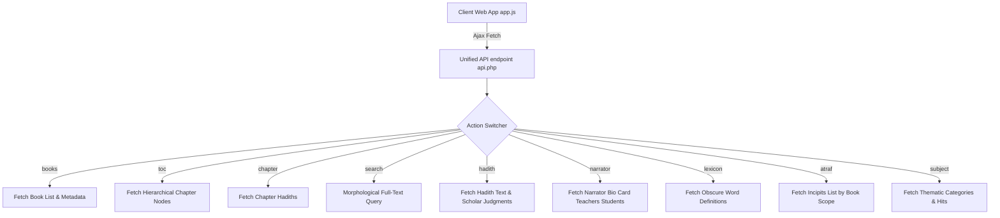

# جامع السنة النبوية - استقصاء شاشات النظام القديم وبوابة الإفتاء
## Developer Reference: Legacy Desktop vs Al-Ifta.net Online Input Forms & Data Mapping

This blueprint provides the exact mapping of user input forms, displayed grid column structures, and database query bindings for both the legacy WPF/C++ desktop application and the official web portal (`https://www.alifta.net/`). Use this reference to write unified JSON API endpoints and responsive RTL search forms in the new web system.

---

## 1. Global Comparison Table of Screens & Forms

| الشاشة / الخدمة (Screen Service) | مسار البوابة (Web URL Path) | عناصر الإدخال والتحكم (DOM Input Elements) | أعمدة شبكة البيانات (Display Grid Columns) | منطق قاعدة البيانات (Database Logic Mapping) |
| :--- | :--- | :--- | :--- | :--- |
| **1. كتب المتون** (Hadith Books) | `/viewmtnbooks.html` | `rbHadithNum` (عرض برقم), `txtHadithNumber`, `ddlTarqeemType` (نوع الترقيم), `rbPartPageNum` (جزء وصفحة), `txtPartNum`, `txtPageNum`, `rbTOC` (شجرة) | `م` (مسلسل), `الكتاب`, `التصنيف`, `المصنف`, `الوفاة` | جدول `Book` (حيث `ID <= 33`) وجدول `BookTOC_Hadith` |
| **2. الكتب الخدمية** (Auxiliary Books) | `/viewservingbooks.html` | `rbPartPageNum`, `txtPartNum`, `txtPageNum`, `rbTOC` | `م`, `الكتاب`, `التصنيف`, `المصنف` | جدول `Book` (حيث `ID >= 34`) وجدول `BookTOC_Services` |
| **3. قائمة الأطراف** (Incipits List) | `/viewatraflist.html` | `chkBookAll` (كل الكتب), `chkBook_X`, `chkHadithTypeSelectAll`, `chkHadithTypeQodsy`... | `م`, `الكتاب`, `التصنيف`, `المصنف`, `الوفاة` | الاستعلام من `BookTOC_Hadith.Tarf` مع تصفية نوع الحديث ونطاق الكتب |
| **4. أطراف على الأسانيد** (Chains Incipits) | `/viewatrafasaned.html` | `ucOnDemandTreeWithSearch_hidSearchText` (حقل البحث), `ddlAtrafAsanedTypes` (نوع الإسناد) | `م`, `صاحب المسند` (الصحابي الراوي) | ربط جداول `AsanedHadiths` و`BookTOC_Hadith` و`Nouns` (الصحابة) |
| **5. متفق وزوائد المصنفات** (Agreed & Additions) | `/viewatrafextra.html` | `rblType` (`rblType_0` متفق, `rblType_1` زوائد), `gvBooks1` (الكتب الأساسية), `gvBooks2` (الكتب المقارنة) | `م`, `الكتاب` (الكتب المشتملة على الزوائد/الاتفاق) | البحث في جداول المقارنات `HMatnComparison1..33` حسب `MasterID` و`SlaveID` |
| **6. زوائد الرواة عن المصنفين** (Narrator Additions) | `/viewrwahextra.html` | `gvRwahExtra` (اختيار الرواة المعنيين بالزوائد) | `الكتاب`, `المصنف`, `عدد الأحاديث` | جدول زوائد الرواة `ExpRawyModbaj` |
| **7. المتون المجمعة** (Combined Matns) | `/groupedmtn.html` | حقول مخفية لمعرفات الأحاديث المندمجة | `م`, `طرف الحديث`, `الكتاب`, `رقم الحديث` | جدول المجموعات `HGamhAlMatn` وجدول نصوص المتون المدمجة `HCompoundMatn` |
| **8. تعريفات** (Definitions Tree) | `/definitions.html` | قائمة الكتب المنسدلة `lbMtnBooks` | شجرة تعاريف مصطلحات علم الحديث ومصنفيه | شجرة مصطلحات الحديث `HadithExpressionsTree` |
| **9. قائمة الرواة** (Narrators List) | `/viewrwah.html` | حقل نص للبحث, وقائمة معايير البحث `cblSearchField` (الاسم، الكنية، النسب...) | `م`, `اسم الراوي`, `الشهرة`, `اللقب`, `الكنية`, `النسب`, `تاريخ الوفاة`, `عدد المرويات` | جدول الرواة والأعلام `Nouns` (حيث `IsRawy = 1`) |
| **10. رواة كتاب / كتب** (Book Narrators) | `/viewrwahbooks.html` | `rblRwahBooks` (رواة كتاب, متفرد بهم, متفق عليهم) وتشيك بوكس للكتب | `م`, `اسم الراوي`, `الشهرة`, `اللقب`, `الكنية`, `النسب`, `تاريخ الوفاة`, `عدد المرويات` | ربط جداول الرواة بكتبهم `NounsBooks` وتصفية النتائج |
| **11. تصنيفات الرواة** (Classifications) | `/viewrwahclassification.html` | شجرة التصنيفات الجيلية والمرتبية للرواة | `م`, `اسم الراوي`, `الشهرة`, `اللقب`... | تصنيفات الرواة عبر `NounsRelationsTypes` و`Nouns` |
| **12. ألفاظ الجرح والتعديل** (Critique Words) | `/viewrwahgarh.html` | `rblGarh` (ألفاظ جرح وتعديل، ألفاظ تقريب), قائمة منسدلة `ddlGarhTypes` | `م`, `ألفاظ الجرح والتعديل` | مراتب وكلمات الجرح والتعديل في `NounsGarh` و`NounsGarhLinks` |
| **13. أقوال أهل العلم في الرواة** (Bio Opinions) | `/viewscientistssayinginrwah.html`| اختيار الناقد أو العالم ومطالعة أقواله | `م`, `الناقد` (اسم العالم الجارح/المعدل), `الحاكي` | جدول أقوال العلماء في الرواة `NounsScientistsSays` |
| **14. شجرة الربط الموضوعي** (Thematic Tree) | `/viewsubjecttree.html` | شجرة المباحث الفقهية والعقائدية والآداب | شجرة الفهارس الموضوعية والفقرات المقابلة | شجرة الموضوعات `Subject` وجدول الربط بالحديث `SubjectHit` |
| **15. ربط بالمخالف** (Controversial Reconciler)| `/viewmokhaleftree.html` | شجرة المباحث المشكلة وتخريج الجمع بينها | شجرة الأحاديث المتعارضة ظاهرياً مع الحلول | جدول شجرة التعارض `HadithControversialTree` والحلول |
| **16. معجم غريب الحديث** (Lexicon) | `/viewlexiconghareeb.html` | البحث عن جذور وألفاظ غريب الحديث | شجرة المواد اللغوية ومعانيها | جدول غريب الحديث `LexiconItems` وتفسيراته في `LexiconDescrp` |
| **17. معجم الأماكن والبلدان** (Places Lexicon)| `/viewlexiconplaces.html` | استعراض المدن والبلدان الجغرافية للرواة | قائمة الأماكن، والبلدان، وتراجم الرواة المرتبطين بها | مدن ولادة وإقامة الرواة في `Nouns` (`BirthCity`, `LivingCity`) |
| **18. تطبيقات المصطلح** (Terminology Apps) | `/viewexpressiontree.html` | تصفح شجرة تطبيقات مصطلح الحديث | شجرة أنواع الإسناد وصيغ الأداء المقابلة | جداول صيغ الأداء `AsanedTahdeth` وأنواع الإسناد `AsanedTypes` |
| **19. أمثال الحديث** (Hadith Proverbs) | `/viewamthal.html` | حقول البحث في الأمثال والتشبيهات النبوية | قائمة الأمثال النبوية المرتبطة بمتونها | جدول الأمثال النبوية المعتمد `Amthal` |
| **20. تواريخ المتون** (Muton Dates) | `/viewmutondates.html` | استعراض السيرة النبوية والمغازي زمنياً | الأحداث التاريخية، والسنوات، والأحاديث المصاحبة لها | جدول تواريخ المتون والأحداث `MatnDates` |
| **21. في الحكم على الحديث** (Hadith Grade) | `/viewscsayhadith.html` | استعراض الأحكام النقدية لعلماء الجرح والتعديل| أحكام العلماء (صحيح، حسن، ضعيف) المسندة للمتنين | أحكام الأحاديث في `HadithJudgmentHits` و`HadithJudgmentSays` |
| **22. في علوم الحديث** (Hadith Sciences) | `/viewscsayscience.html` | شجرة مباحث علم الحديث النظري | شروح المباحث والاصطلاحات العلمية للعلماء | جدول شروح علوم الحديث الموثقة `ScSaysInHadithScience` |
| **23. فهرس الآيات** (Quran Verses Index) | `/viewindexitems_indexid_2.html` | البحث في الآيات الكريمة المقتبسة في الأحاديث | قائمة السور والآيات، والأحاديث التي وردت فيها | آيات القرآن الكريم في `QuranAyat` ومحرك ربطها بالحديث |
| **24. فهرس الأعلام** (Names Index) | `/viewindexitems_indexid_3.html` | البحث في الأعلام (الصحابة وغيرهم) غير الرواة | قائمة الأعلام والأحاديث المقترنة بذكرهم | جدول الفهارس الموحد `Index` و`IndexItem` (رمز الفهرس 3) |
| **25. فهرس الشعر** (Poetry Index) | `/viewindexitems_indexid_14.html`| البحث في الأبيات الشعرية المستشهد بها | الأبيات والأشعار المذكورة في المتون ومصادرها | جدول الأبيات الشعرية `IndexItem` (رمز الفهرس 14) |

---

## 2. Detailed Technical Blueprints for Core Modules

### 2.1. Module: عرض (Display / Reading Viewer)

#### 2.1.1. كتب المتون (Hadith Books Browser)
*   **WPF Desktop Implementation**: Uses a split screen layout. Left pane shows `TreeView` hierarchy of `BookTOC_Hadith` (where `IsLeaf = 0`). Selecting a leaf node (`IsLeaf = 1`) triggers XML loading, applying XSLT stylesheet `HadithXSL.xsl` to render the Hadith inside the ActiveX WebBrowser control.
*   **Online Portal Implementation (`/viewmtnbooks.html`)**:
    *   *Input elements*: 
        *   `ContentPlaceHolder1_ViewMatnBooks1_rbHadithNum` (Radio) -> Selects Hadith Numbering display method.
        *   `ContentPlaceHolder1_ViewMatnBooks1_txtHadithNumber` (Input Text) -> Standard Hadith index input.
        *   `ContentPlaceHolder1_ViewMatnBooks1_ddlTarqeemType` (Dropdown Select) -> Selects Numbering Authority (`TarqeemHarf` vs `TarqeemMatboa1`).
        *   `ContentPlaceHolder1_ViewMatnBooks1_rbPartPageNum` (Radio) -> Selects Volume & Page display method.
        *   `ContentPlaceHolder1_ViewMatnBooks1_txtPartNum` (Input Text) -> Volume number.
        *   `ContentPlaceHolder1_ViewMatnBooks1_txtPageNum` (Input Text) -> Page number.
        *   `ContentPlaceHolder1_ViewMatnBooks1_rbTOC` (Radio) -> Toggle Hierarchical Chapter view.
    *   *Displayed Data*: Grid `ContentPlaceHolder1_ViewMatnBooks1_gvBooks` (Columns: `م`, `الكتاب`, `التصنيف`, `المصنف`, `الوفاة`).
*   **SQL Backend Mapping (New Web Service API)**:
    ```sql
    -- 1. List Available Hadith Books
    SELECT ID, Title, Summary, AuthorID FROM Book WHERE ID <= 33 ORDER BY ID;
    
    -- 2. Retrieve Hadith by Number and Book (Harf vs Print Authority)
    SELECT MainID, Content, PartNum, PageNum, Tarf 
    FROM BookTOC_Hadith 
    WHERE BookID = :book_id 
      AND (CASE WHEN :tarqeem_type = 'TarqeemHarf' THEN HadithNum ELSE PrintHadithNum END) = :hadith_num 
      AND IsLeaf = 1;
      
    -- 3. Retrieve Hadith by Volume & Page
    SELECT MainID, Content, HadithNum, Tarf 
    FROM BookTOC_Hadith 
    WHERE BookID = :book_id AND PartNum = :part_num AND PageNum = :page_num AND IsLeaf = 1;
    ```

#### 2.1.2. قائمة الأطراف (Hadith Incipits Directory)
*   **WPF Desktop Implementation**: Text search box on top, binding characters `أ-ي` to load incipits list. Clicking an incipit displays the text of the Hadith.
*   **Online Portal Implementation (`/viewatraflist.html`)**:
    *   *Input elements*: 
        *   CheckBox Grid `gvBooks` with columns to filter active book scopes.
        *   Alphabet filter bar (`أ` through `ي` links).
        *   Incipit text search box.
        *   Hadith category scope toggles: `chkHadithTypeQodsy` (Qudsy), `chkHadithTypeMarfoa` (Marfu'), `chkHadithTypeMawqof` (Mawquf), `chkHadithTypeMaqtoa` (Maqtu').
    *   *Displayed Data*: Search grid of incipits matching the criteria.
*   **SQL Backend Mapping (New Web Service API)**:
    ```sql
    -- Fetch incipits with alphabetical filter, book IDs, and Hadith status category
    SELECT MainID, Tarf, BookName, HadithNum 
    FROM BookTOC_Hadith 
    WHERE IsLeaf = 1 
      AND BookID IN (:book_ids) 
      AND Tarf LIKE :letter_prefix 
      AND HadithType IN (:type_filters)
    ORDER BY Tarf ASC
    LIMIT :offset, :limit;
    ```

---

### 2.2. Module: رواة (Narrators Subsystem)

#### 2.2.1. قائمة الرواة (Narrators Directory & Profile Card)
*   **WPF Desktop Implementation**: Open Narrator window. Search input box. Grid displaying details. Clicking a narrator opens an 8-tab personal card popup, loading biographical narratives and linking teachers/students.
*   **Online Portal Implementation (`/viewrwah.html`)**:
    *   *Input elements*: 
        *   Search query input textbox.
        *   Checklist container `cblSearchField` containing checkbox criteria: `Name` (Search inside Full Name), `Kunia` (Search Kunia), `Laqab` (Search Title/Epithet), `Nasab` (Search Lineage).
        *   Master criteria checkbox `cbAllSelected`.
    *   *Displayed Data*: Narrators list grid `ContentPlaceHolder1_ViewRwahUC1_gvRwah` (Columns: `م`, `اسم الراوي`, `الشهرة`, `اللقب`, `الكنية`, `النسب`, `تاريخ الوفاة`, `عدد المرويات`).
    *   *Narrator 8-Tab Profile Card Components*:
        *   **Tab 1: البطاقة (Info Card)** -> Elements: `#lblName` (Genealogical Name), `#lblKunia` (Patronymic Kunia), `#lblNasab` (Pedigree), `#lblLivingCity` (Resident Cities), `#lblDeathYear` (Hijri Death Year), `#lblDeathCity` (Death City), `#lblJourneyCity` (Travel Cities), `#lblTabaqa` (Generation Layer), `#lblMartabaIbnHajar` (Ibn Hajar grade), `#lblMartabaZahabi` (Al-Dhahabi grade).
        *   **Tab 2: روى عن (Teachers)** -> Triggers dynamic loading of teachers list.
        *   **Tab 3: روى عنه (Students)** -> Triggers dynamic loading of students list.
        *   **Tab 4: جرح وتعديل (Jarh wa Ta'dil)** -> Critiques list.
        *   **Tab 5: تصنيفات خاصة (Classifications)** -> Specific classifications.
        *   **Tab 6: صور الورود (Naming Forms)** -> Documented naming variations.
        *   **Tab 7: مروياته في كتب المتون (Hadiths Count)** -> List of narrations.
        *   **Tab 8: مصادر الترجمة (Sources)** -> References references.
*   **SQL Backend Mapping (New Web Service API)**:
    ```sql
    -- 1. Search Narrator list matching select criteria
    SELECT ID, Name, AbbName, Kunia, Laqab, Nasab, DeathYear, HadithsCount 
    FROM Nouns 
    WHERE IsRawy = 1 
      AND (
        (:search_name = 1 AND Name LIKE :query) OR 
        (:search_kunia = 1 AND Kunia LIKE :query) OR
        (:search_laqab = 1 AND Laqab LIKE :query) OR
        (:search_nasab = 1 AND Nasab LIKE :query)
      )
    ORDER BY HadithsCount DESC 
    LIMIT :offset, :limit;
    
    -- 2. Fetch Personal Biography Card Variables
    SELECT Name, Kunia, Laqab, Nasab, LivingCity, DeathYear, DeathCity, JourneyCity, Tabaqa, MartabaIbnHajar, MartabaZahabi 
    FROM Nouns 
    WHERE ID = :rawy_id;
    
    -- 3. Fetch Teachers (Tab 2)
    SELECT n.ID, n.Name, n.AbbName 
    FROM NounsRelations r
    JOIN Nouns n ON r.FirstRawyID = n.ID
    WHERE r.SecondRawyID = :rawy_id AND r.IsShiekh = 1;
    
    -- 4. Fetch Students (Tab 3)
    SELECT n.ID, n.Name, n.AbbName 
    FROM NounsRelations r
    JOIN Nouns n ON r.SecondRawyID = n.ID
    WHERE r.FirstRawyID = :rawy_id AND r.IsShiekh = 1;
    
    -- 5. Fetch Critique Comments (Tab 4)
    SELECT s.ScientistName, y.Say 
    FROM NounsGarhLinks gl
    JOIN NounsGarh g ON gl.GarhID = g.ID
    JOIN NounsScientists s ON gl.ScientistID = s.ID
    WHERE gl.RawyID = :rawy_id;
    ```

---

### 2.3. Module: مكانز موضوعية (Thematic Thesauri)

#### 2.3.1. شجرة الربط الموضوعي (Thematic Subject Explorer)
*   **WPF Desktop Implementation**: Tree View explorer loading categories from the database. Clicking a subject category query extracts matching Hadith incipits and renders them in the browser.
*   **Online Portal Implementation (`/viewsubjecttree.html`)**:
    *   *Input elements*: Tree search hidden parameters (`hidSearchText`, `hidLastNodeIndex`, `hidCurrentNodeMatches`) and collapsible node elements.
    *   *Displayed Data*: Categorized tree. Selection loads the linked Hadith incipits in the dashboard.
*   **SQL Backend Mapping (New Web Service API)**:
    ```sql
    -- 1. Load Subject Category Tree Node
    SELECT ID, Text, ParentID, LeftValue, RightValue FROM Subject ORDER BY LeftValue;
    
    -- 2. Fetch Hadiths Linked under Subject Node Scope (Using Nested Set Values)
    SELECT h.MainID, h.BookName, h.Tarf, h.HadithNum
    FROM SubjectHit sh
    JOIN BookTOC_Hadith h ON sh.ParagraphMainID = h.MainID
    JOIN Subject s ON sh.SubjectID = s.ID
    WHERE s.LeftValue >= :left_val AND s.RightValue <= :right_val AND h.IsLeaf = 1;
    ```

---

### 2.4. Module: معاجم (Dictionaries Subsystem)

#### 2.4.1. معجم غريب الحديث (Lexicon of Obscure Words)
*   **WPF Desktop Implementation**: Underlined words in Hadith text are wrapped with custom HTML hyperlink trigger actions (e.g. `LexiconActivation_WordID`). Clicking it displays the dictionary definition.
*   **Online Portal Implementation (`/viewlexiconghareeb.html`)**:
    *   *Input elements*: Root-word search inputs and collapsible alphabetical lexicons.
    *   *Displayed Data*: Definition block. Underlined tags in main body: `<غريب ربط="LexiconItemID">`.
*   **SQL Backend Mapping (New Web Service API)**:
    ```sql
    -- Fetch dictionary definition for interactive tag click
    SELECT s.Content 
    FROM LexiconDescrp ld
    JOIN BookTOC_Services s ON ld.DescrpMainID = s.MainID
    WHERE ld.LexiconItemID = :word_id;
    ```

---

## 3. unified Web API Recommendation (JSON Endpoints)

To support all these screens in the new web system, design the backend controller to expose a unified JSON endpoint (`api.php` or equivalent) that manages parameter-driven actions:



### Example Endpoint JSON Responses

#### `/api.php?action=hadith&id=427`
Returns Hadith content, breadcrumbs, authenticity judgments, and transmission routes.
```json
{
  "success": true,
  "hadith": {
    "MainID": 427,
    "BookID": 1,
    "BookName": "صحيح البخاري",
    "Content": "حدثنا <راوي ربط=\"1428\">عبد الله بن يوسف</راوي> قال أخبرنا <راوي ربط=\"224\">مالك</راوي> عن <راوي ربط=\"847\">أبي الزناد</راوي>... إنما الأعمال بالنيات...",
    "HadithNum": 1
  },
  "breadcrumbs": [
    { "MainID": 12, "Title": "كتاب الإيمان" },
    { "MainID": 45, "Title": "باب العمل بالنية" }
  ],
  "judgments": [
    { "ScientistName": "ابن حجر العسقلاني", "Say": "صحيح متفق عليه" }
  ],
  "chains": [
    { "SanadID": 9284, "HadithMainID": 427 }
  ]
}
```

#### `/api.php?action=narrator&id=1428`
Returns detailed personal card biography, resident/death cities, Ibn Hajar / Al-Dhahabi grades, teachers, and students.
```json
{
  "success": true,
  "narrator": {
    "ID": 1428,
    "Name": "عبد الله بن يوسف التنيسي الكلاعي",
    "AbbName": "عبد الله بن يوسف",
    "Kunia": "أبو محمد",
    "Laqab": "التنيسي",
    "Nasab": "الكلاعي",
    "Tabaqa": "الطبقة العاشرة",
    "DeathYear": "220 هـ",
    "LivingCity": "تنيس ، دمشق",
    "DeathCity": "تنيس",
    "MartabaIbnHajar": "ثقة ثبت",
    "MartabaZahabi": "الحافظ أحد الأعلام"
  },
  "sheikhs": [
    { "ID": 224, "Name": "مالك بن أنس الأصبحي" }
  ],
  "talamidh": [
    { "ID": 1, "Name": "محمد بن إسماعيل البخاري" }
  ]
}
```
